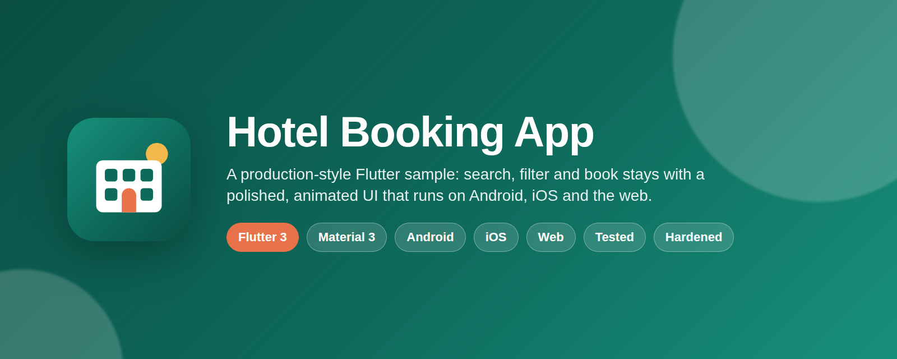
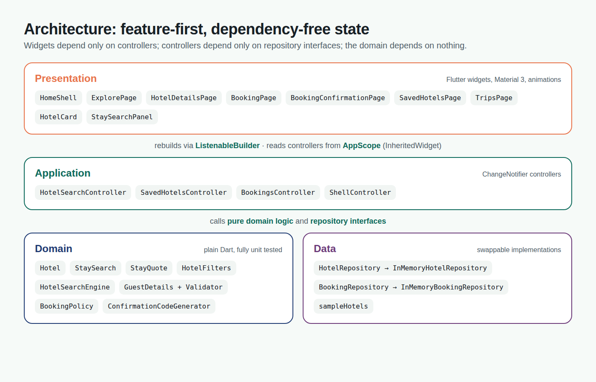

<p align="center">
  
</p>

# Hotel Booking App

[](https://github.com/sagnik150699/hotel_booking_application_flutter/actions/workflows/flutter-ci.yml)


A production-style **Flutter hotel booking app** for Android, iOS and the web.
Search and filter stays, open a hotel, plan the dates and guests, check out with
a validated form, get a confirmation code, and manage trips, all with a
polished Material 3 design, real animations, a fully tested domain layer and
security hardening on every platform.

This project is part of [**The Complete Flutter Course: Build Android, iOS, and Web apps**](https://www.codingliquids.com/courses/Flutter-Course-Learn-to-Build-Android-iOS-and-Web-apps-637b978ee4b08f9aaa22d2cb)
on Coding Liquids and is maintained by **Sagnik Bhattacharya**
([sagnikbhattacharya.com](https://sagnikbhattacharya.com)).

## Screenshots

Captured from the release web build in headless Chromium at phone, tablet and
desktop viewport sizes (the same responsive layouts the Android and iOS apps
render). See [Regenerating images](#regenerating-images-and-screenshots).

### Phone layout (Android and iOS)

| Explore | Hotel details | Checkout |
| :-: | :-: | :-: |
|  |  |  |

| Confirmation | Trips | Dark mode |
| :-: | :-: | :-: |
|  |  |  |

### Tablet layout


### Desktop and web layout

| Explore | Hotel details |
| :-: | :-: |
|  |  |

| Checkout | Dark mode |
| :-: | :-: |
|  |  |

## Features

**Search and discovery**

- Live destination search across city, area, hotel name, category and
  amenities, with multi-word matching ("goa pool").
- Date-range picker and guest stepper; hotels that cannot host the party are
  hidden automatically.
- Sort by recommendation (rating weighted by review count), price or rating.
- Refine by free cancellation, minimum rating, category and amenity, with a
  one-tap clear.
- Loading skeletons, an empty state that resets the search, and an error
  state with retry.

**Booking flow**

- Hotel details with cover art, rating summary, amenities and a stay planner
  that re-quotes the price as dates or guests change.
- Checkout form with validated name, e-mail and phone fields, house-rules
  consent and an itemised price breakdown (room, 12% tax, service fee).
- Confirmation page with a copyable, cryptographically random reference
  such as `HB-7KQ2-M9XT`.
- Trips tab with upcoming and past/cancelled bookings and free cancellation
  up to the day before check-in. Overlapping bookings at the same hotel are
  refused.

**Design**

- Material 3 with light and dark themes derived from one seed colour.
- Responsive shell: bottom navigation on phones, a navigation rail on
  tablets, an extended rail with the brand mark on desktop and wide web
  windows; results flow from one to three columns.
- Animations: staggered card entrances, hero cover transitions, a "pop" on
  save, animated price totals, cross-fading tabs, hover lift on pointer
  devices, shimmer skeletons and a self-drawing success tick.
- Thirteen illustrated hotels across eight Indian cities; every raster
  asset (covers, app icons, launch images, README images) is generated from
  vector definitions so it can be regenerated at any size.

**Engineering**

- Feature-first architecture with a plain-Dart domain layer, repository
  interfaces, `ChangeNotifier` controllers and an `InheritedWidget` scope.
  No third-party runtime packages.
- 100 unit and widget tests (97% line coverage) including an end-to-end
  booking test, run in CI with formatting and strict analysis.
- CI builds the web bundle, Android debug and release APKs and an unsigned
  iOS app on every push.
- Security hardening documented in [SECURITY.md](SECURITY.md).

## Architecture



```text
lib/
  main.dart                          # entry point; edge-to-edge system UI
  src/
    app/
      hotel_booking_app.dart         # MaterialApp, theme mode, injectable repositories
      app_scope.dart                 # AppDependencies + InheritedWidget (no packages)
      theme/app_theme.dart           # Material 3 light/dark themes, spacing, durations
    core/
      dates/date_only.dart           # calendar-date helpers (nights, midnight normalisation)
      formatting/                    # Indian-grouped rupees, dates, plurals
      responsive/                    # Breakpoints, ScreenSize, ResponsiveLayout/Builder
      validation/input_sanitizer.dart# strips control/invisible chars, caps length
      load_status.dart
    features/
      hotels/
        domain/                      # Hotel, StaySearch, StayQuote, HotelFilters, HotelSearchEngine
        data/                        # HotelRepository + in-memory implementation, sampleHotels
        application/                 # HotelSearchController, SavedHotelsController
        presentation/
          pages/                     # ExplorePage, HotelDetailsPage, SavedHotelsPage
          widgets/                   # HotelCard, HotelCover, StaySearchPanel, HotelFiltersBar, ...
      booking/
        domain/                      # GuestDetails + validator, Booking, BookingPolicy, ConfirmationCodeGenerator
        data/                        # BookingRepository + in-memory implementation
        application/                 # BookingsController
        presentation/
          pages/                     # BookingPage, BookingConfirmationPage, TripsPage
          widgets/                   # StaySummaryCard, PriceBreakdown, BookingCard
      shell/
        application/shell_controller.dart
        presentation/home_shell.dart # NavigationBar / NavigationRail shell
    shared/widgets/                  # EntranceAnimation, FadeIndexedStack, HoverLift, Shimmer, EmptyState, BrandMark, ...
test/                                # mirrors lib/; helpers/pump_app.dart boots the app with a fixed clock
tool/
  generate_images.cjs                # renders covers, icons and docs images from SVG
  capture_screenshots.cjs            # drives the web build through the flows and saves screenshots
  verify_web.cjs                     # loads the web build under its CSP and fails on errors
```

**How data flows.** Widgets read controllers from `AppScope.of(context)` and
rebuild through `ListenableBuilder`. Controllers hold state (`StaySearch`,
`HotelFilters`, saved ids, bookings) and call pure domain functions such as
`HotelSearchEngine.search` or `BookingPolicy.check`. Repositories sit behind
interfaces with injectable latency and clock, so tests run with zero delay and
a fixed "today", and a real backend can be dropped in without touching a
widget.

## Getting started

Requires Flutter 3.38 or newer (Dart 3.10+). Check with `flutter --version`.

```bash
git clone https://github.com/sagnik150699/hotel_booking_application_flutter.git
cd hotel_booking_application_flutter
flutter pub get
flutter run            # pick a device: Chrome, an Android emulator or an iOS simulator
```

### Run on the web

```bash
flutter run -d chrome
```

Production bundle (CanvasKit served from your own origin, matching the CSP):

```bash
flutter build web --release --no-web-resources-cdn
# serve build/web with any static host; pass --base-href /subpath/ if not at the root
```

Verify the bundle under its Content Security Policy in headless Chromium:

```bash
npm install -g playwright && npx playwright install chromium
NODE_PATH="$(npm root -g)" node tool/verify_web.cjs
```

### Run on Android

```bash
flutter run -d <android-device-or-emulator>
flutter build apk --release          # build/app/outputs/flutter-apk/app-release.apk
flutter build appbundle --release    # for Google Play
```

Release builds are shrunk and obfuscated. To sign them with your own key,
create `android/key.properties` (git-ignored):

```properties
storeFile=/absolute/path/to/upload-keystore.jks
storePassword=...
keyAlias=upload
keyPassword=...
```

Without that file the release build is signed with the debug key so
`flutter run --release` works on a fresh clone.

### Run on iOS

```bash
cd ios && pod install && cd ..      # only needed once plugins are added
flutter run -d <iphone-or-simulator>
flutter build ios --release          # open ios/Runner.xcworkspace in Xcode to archive
```

The deployment target is iOS 13. App Transport Security is left at its strict
default and the app declares that it uses only standard encryption.

## Testing and quality

```bash
dart format --set-exit-if-changed lib test
flutter analyze --fatal-infos
flutter test --coverage
```

- `test/core` covers formatting, date maths, sanitisation and breakpoints.
- `test/features/*/domain` and `data` cover search, filters, quotes, guest
  validation (including injection-style input), confirmation codes, booking
  policy and the repositories.
- `test/features/*/presentation` and `test/features/shell` cover every page,
  the responsive shell and an end-to-end booking, using
  `test/helpers/pump_app.dart` to boot the app with a fixed clock and no
  latency. `test/flutter_test_config.dart` makes missed taps fatal.

CI (`.github/workflows/flutter-ci.yml`) runs the checks above with
`contents: read` permissions, uploads coverage, and builds web, Android and
iOS artifacts. Dependabot keeps actions and pub packages current.

## Security

Highlights (full list in [SECURITY.md](SECURITY.md)):

- All free-text input is sanitised (control, zero-width and bidi characters
  removed, length capped) and validated both in the form and in the domain.
- Confirmation codes come from `Random.secure()`; personal data never
  appears in `toString()` or logs, and `avoid_print` is an error.
- Android: no backups, no cleartext traffic, system-CA-only network security
  config, R8 shrinking, signing secrets git-ignored, no permissions.
- iOS: strict App Transport Security, iOS 13+, encryption exemption declared.
- Web: Content Security Policy with `default-src 'self'`, strict referrer
  policy, CanvasKit served from the same origin.
- No third-party runtime dependencies; strict analyzer and least-privilege CI.

## Regenerating images and screenshots

All raster assets are produced by scripts so they stay consistent:

```bash
npm install -g playwright && npx playwright install chromium

# hotel covers, Android/iOS/web icons, launch images, README banner + diagram
NODE_PATH="$(npm root -g)" node tool/generate_images.cjs

# README screenshots (semantics are enabled so the script can drive the app)
flutter build web --release --no-web-resources-cdn --dart-define=SCREENSHOT_MODE=true -o build/web-shots
WEB_DIR=build/web-shots NODE_PATH="$(npm root -g)" node tool/capture_screenshots.cjs
```

## FAQ

**Is this a production booking system?** No. Inventory and bookings are
in-memory samples; there is no backend, authentication or payment. The
architecture is designed so those can be added behind the existing
repository interfaces.

**Why no state-management package?** The app deliberately shows the
mechanism those packages build on: `ChangeNotifier` controllers exposed
through an `InheritedWidget` and consumed with `ListenableBuilder`. Swapping
in Provider or Riverpod is a small, local change.

**Where do the hotel pictures come from?** They are illustrations generated
from SVG scenes by `tool/generate_images.cjs`, so the repository ships no
third-party photography.

## Author

**Sagnik Bhattacharya**, founder of Coding Liquids.
Website: [sagnikbhattacharya.com](https://sagnikbhattacharya.com)
